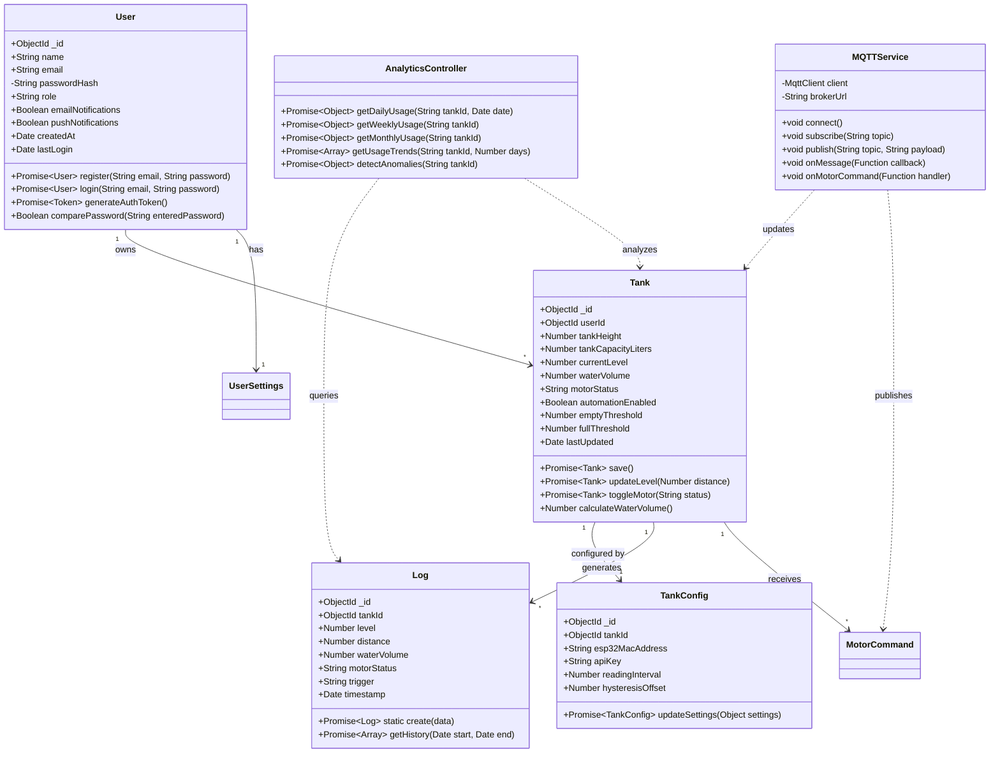
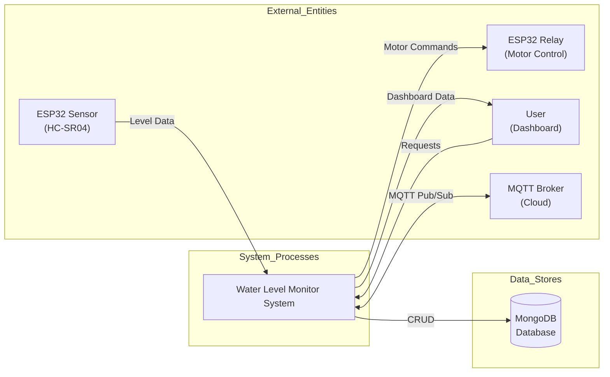
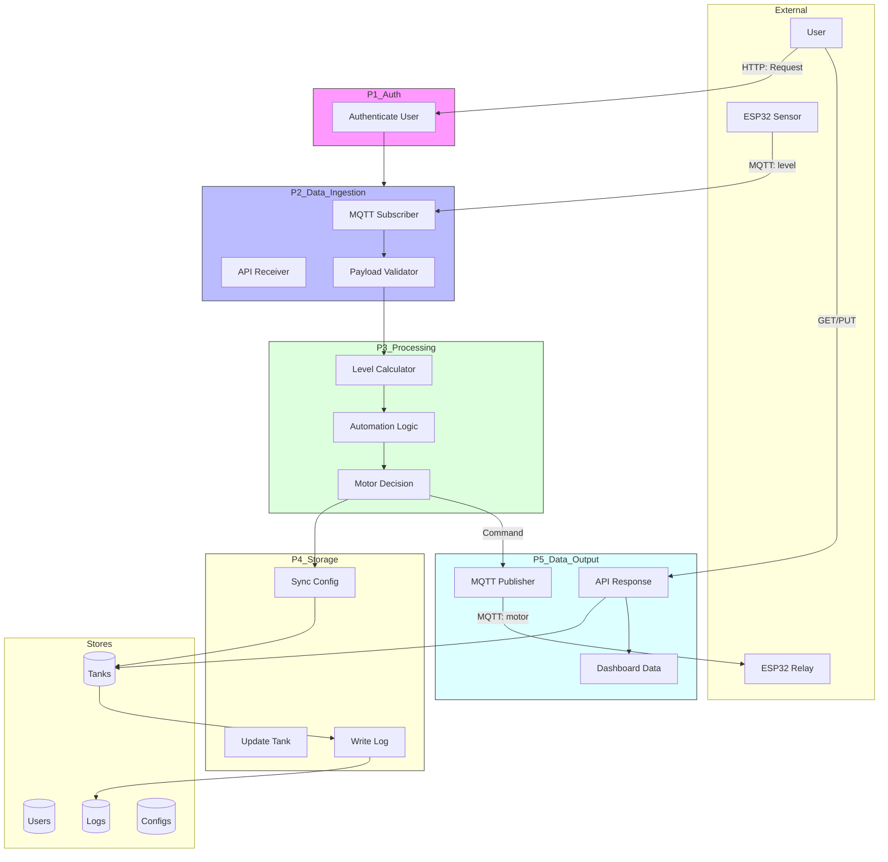
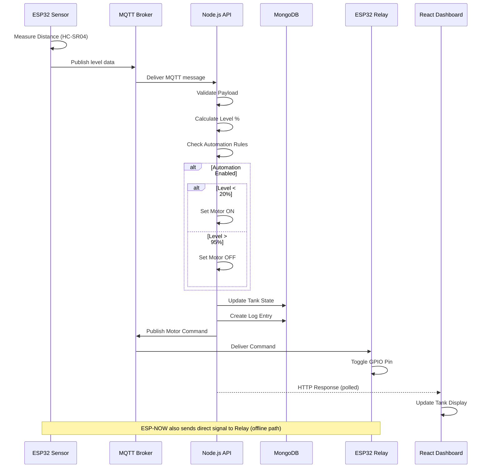
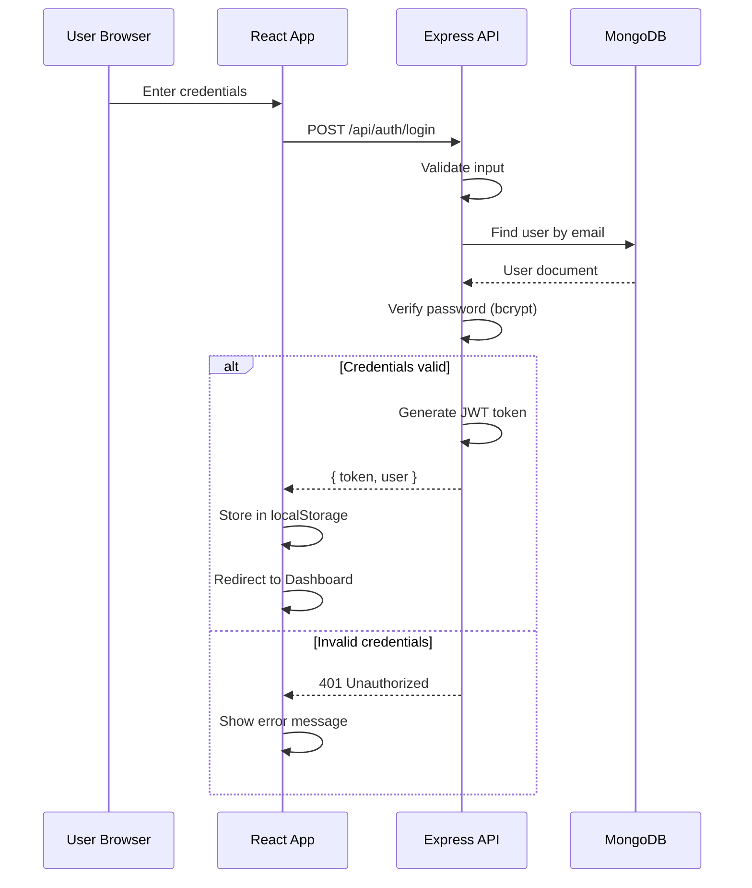
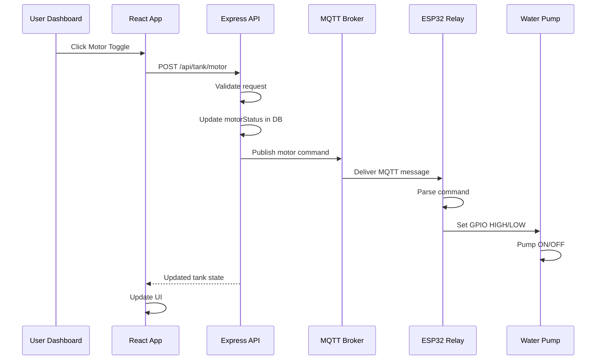
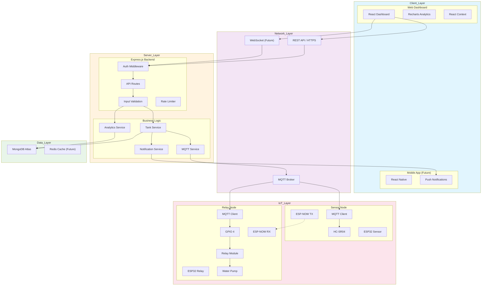
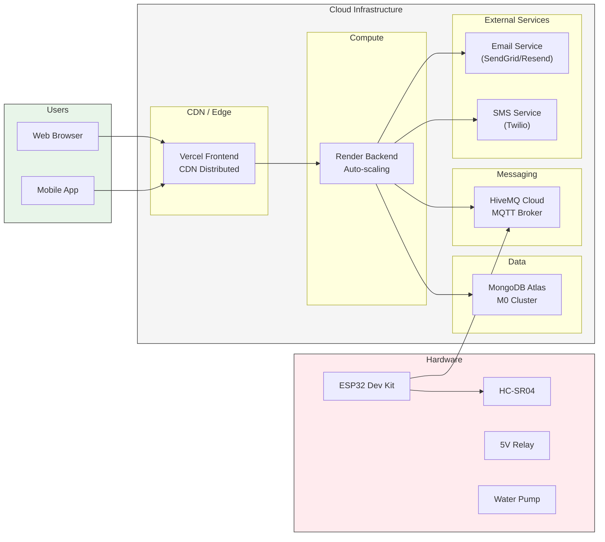
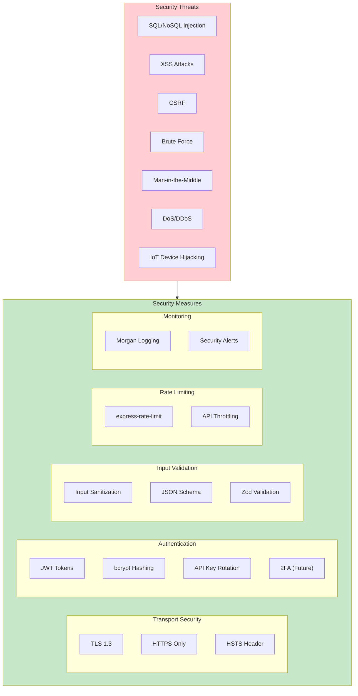

# Water Level Monitor - System Diagrams

## 1. ER Diagram (Entity-Relationship)

```mermaid
erDiagram
    USER ||--o{ TANK : "owns"
    USER ||--o{ USER_SETTINGS : "has"
    TANK ||--o{ TANK_CONFIG : "has"
    TANK ||--o{ LOG : "generates"
    TANK ||--o{ MOTOR_COMMAND : "receives"
    TANK {
        ObjectId _id PK
        ObjectId userId FK
        float tankHeight "cm"
        float tankCapacityLiters "L"
        int currentLevel "%"
        float waterVolume "L"
        string motorStatus "ON|OFF"
        boolean automationEnabled
        float emptyThreshold "%"
        float fullThreshold "%"
        date lastUpdated
    }
    
    USER {
        ObjectId _id PK
        string name
        string email UK
        string passwordHash
        string role "user|admin"
        boolean emailNotifications
        boolean pushNotifications
        date createdAt
        date lastLogin
    }
    
    USER_SETTINGS {
        ObjectId _id PK
        ObjectId userId FK UK
        string notificationLevel "low|critical|all"
        string theme "light|dark|auto"
        int refreshInterval "seconds"
    }
    
    TANK_CONFIG {
        ObjectId _id PK
        ObjectId tankId FK UK
        string esp32MacAddress
        string apiKey
        int readingInterval "seconds"
        float hysteresisOffset "%"
    }
    
    LOG {
        ObjectId _id PK
        ObjectId tankId FK
        int level "%"
        float distance "cm"
        float waterVolume "L"
        string motorStatus "ON|OFF"
        string trigger "auto|manual|esp32"
        date timestamp
    }
    
    MOTOR_COMMAND {
        ObjectId _id PK
        ObjectId tankId FK
        string command "ON|OFF"
        string source "cloud|local|api"
        date timestamp
    }
```

---

## 2. UML Class Diagram



---

## 3. Data Flow Diagram (DFD Level 0 - Context Diagram)



---

## 4. Data Flow Diagram (DFD Level 1)



---

## 5. Sequence Diagrams

### 5.1 Sensor Data Flow


### 5.2 User Login Flow


### 5.3 Motor Control Flow


---

## 6. System State Diagram (Motor States)

```mermaid
stateDiagram-v2
    [*] --> Idle : System Init
    
    state Idle {
        [*] --> MotorOFF
        MotorOFF --> MotorOFF : Manual OFF
    }
    
    state Filling {
        [*] --> MotorON
        MotorON --> MotorON : Filling continues
    }
    
    Idle --> Filling : Level < emptyThreshold AND automationEnabled
    Idle --> Filling : User Manual Override ON
    Filling --> Idle : Level >= fullThreshold AND automationEnabled
    Filling --> Idle : User Manual Override OFF
    Filling --> Idle : Safety timeout reached
    
    state Filling {
        state "Checking Level" as CL
        MotorON --> CL : Every reading interval
        CL --> MotorON : Level < fullThreshold : Continue
        CL --> [*] : Level >= fullThreshold : Stop
    }
    
    state Idle {
        state "Monitoring" as M
        MotorOFF --> M : Every reading interval
        M --> MotorOFF : Level > emptyThreshold : Wait
        M --> [*] : Level <= emptyThreshold : Start filling
    }
    
    note right of Filling: Hysteresis: OFF at 95%\nON at 20%
    note left of Idle: Safety: Motor OFF if no level\nchange detected for 30 min
```

---

## 7. Component Architecture Diagram



---

## 8. Deployment Architecture



---

## 9. Security Architecture


