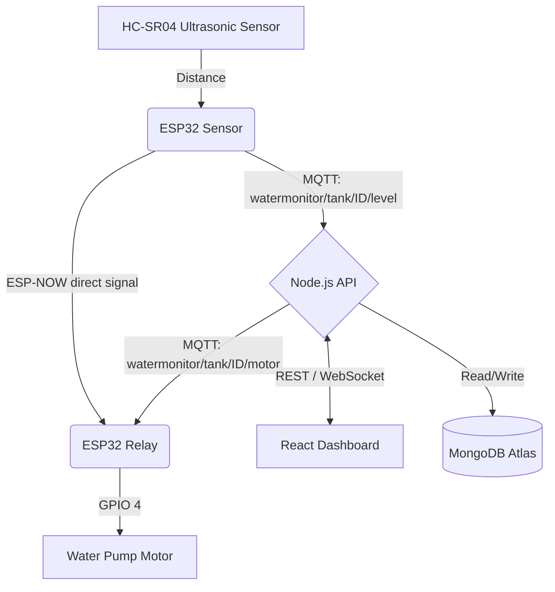

<div align="center">
  
  
  
  
  
  
</div>

<h1 align="center">💧 Smart Water Level Monitoring System</h1>

<p align="center">
  A <strong>full-stack, real-time IoT system</strong> that monitors overhead water tanks using two <strong>ESP32 microcontrollers</strong> communicating via <strong>ESP-NOW (local)</strong> and <strong>MQTT over Wi-Fi (cloud)</strong>. Includes a <strong>React Dashboard</strong>, <strong>Express API</strong>, and <strong>MongoDB</strong> for analytics and history logging.
</p>

---

## 🌐 Live Demo & Deployment

- **Frontend Dashboard:** [https://water-level-monitor-sandy.vercel.app](https://water-level-monitor-sandy.vercel.app)
- The frontend is deployed automatically via Vercel.
- The backend should be hosted on Render or Railway and linked via environment variables.

---

## 🏗 System Architecture

```
┌─────────────────────────────────────────────────────────────────┐
│                         CLOUD LAYER                             │
│  ┌──────────────┐    MQTT     ┌──────────────┐    REST/WS      │
│  │  ESP32       │ ──────────► │  Node.js API │ ◄────────────── │
│  │  Sensor      │             │  (Express)   │                 │
│  └──────┬───────┘             └──────┬───────┘    React UI    │
│         │ ESP-NOW                    │ Read/Write              │
│         ▼ (local direct)             ▼                         │
│  ┌──────────────┐             ┌──────────────┐                 │
│  │  ESP32 Relay │ ◄── MQTT ── │  MongoDB     │                 │
│  │  (Motor)     │             │  (Atlas)     │                 │
│  └──────────────┘             └──────────────┘                 │
└─────────────────────────────────────────────────────────────────┘
```



---

## 🚀 Key Features

| Feature | Description |
|---|---|
| **Dual-Protocol IoT** | ESP32s communicate via **ESP-NOW** (local, offline-safe) and **MQTT** (cloud, remote control) simultaneously |
| **Offline Automation** | Non-blocking architecture ensures ESP-NOW local safety triggers perfectly even if the internet drops |
| **Captive Portal UI** | Both the Sensor and Relay feature a beautifully designed, glassmorphic built-in setup webpage for easy Wi-Fi configuration |
| **Dynamic Calibration** | Thresholds, height, and capacity can be updated via the cloud dashboard and sync instantly to the devices |
| **Real-Time Dashboard** | React UI with animated tank fill visualizer, live level %, and motor toggle |
| **Historical Analytics** | Daily, weekly, and monthly water usage charts powered by Recharts |
| **JWT Authentication** | Secure login/registration with protected routes |
| **Hardware Simulator** | `simulator.js` mocks ESP32 payloads to test the full stack without physical hardware |

---

## 🧰 Tech Stack

### 📡 IoT Firmware (Arduino C++)
- **ESP32** (NodeMCU) — two separate boards
- **HC-SR04** Ultrasonic Distance Sensor
- **ESP-NOW** — direct device-to-device (offline local control)
- **MQTT / PubSubClient** — cloud broker communication
- **Preferences (NVS)** — persistent configuration storage

### ⚙️ Backend
- **Node.js** & **Express** — REST API
- **MongoDB** & **Mongoose** — NoSQL database + schemas
- **JWT** & **Bcrypt.js** — authentication
- **MQTT.js** — broker subscriber for motor commands

### 💻 Frontend
- **React 19 (Vite)** — SPA
- **Tailwind CSS** & **Framer Motion** — styling & animations
- **Recharts** — data visualization
- **Axios** — API client

---

## 📁 Project Structure

```
water-level-monitor/
├── backend/                  # Express.js REST API
│   ├── config/               # MongoDB & MQTT config
│   ├── controllers/          # Route controllers (auth, tank, analytics)
│   ├── middleware/           # JWT auth middleware
│   ├── models/               # Mongoose Schemas (User, Tank, Log)
│   └── routes/               # Express endpoint definitions
│
├── frontend/                 # React Web Dashboard
│   └── src/
│       ├── components/       # TankVisualizer, Navbar, ProtectedRoute
│       ├── pages/            # Dashboard, Analytics, Landing, Login
│       └── context/          # AuthContext (JWT state)
│
├── iot/
│   ├── esp32_sensor/
│   │   └── esp32_sensor.ino  # Sensor firmware (WiFi + MQTT + ESP-NOW TX)
│   ├── esp32_relay/
│   │   └── esp32_relay.ino   # Relay firmware (WiFi + MQTT + ESP-NOW RX)
│   ├── esp32_example.ino     # Legacy all-in-one sketch (single board)
│   └── simulator.js          # Node.js software mock for ESP32
│
└── README.md
```

---

## ⚙️ Quick Start

### 1️⃣ Clone the Repository
```bash
git clone https://github.com/Yuvaraj007A/water-level-monitor.git
cd water-level-monitor
```

### 2️⃣ Start the Backend
```bash
cd backend
npm install
```
Create a `.env` file in `backend/`:
```env
PORT=5000
NODE_ENV=development
MONGO_URI=mongodb+srv://<user>:<pass>@cluster.mongodb.net/water-monitor
JWT_SECRET=your_256_bit_secret
MQTT_BROKER_URL=mqtt://broker.hivemq.com
```
```bash
npm run dev
```

### 3️⃣ Start the Frontend
```bash
cd frontend
npm install
```
Create a `.env` file in `frontend/`:
```env
VITE_API_URL=http://localhost:5000/api
```
```bash
npm run dev
# → http://localhost:5173
```

### 4️⃣ Flash the ESP32s (or simulate)
See the [`iot/README.md`](./iot/README.md) for full hardware setup steps.

To test without hardware:
```bash
cd iot
node simulator.js
```

---

## 📡 MQTT Topics

| Topic | Direction | Payload |
|---|---|---|
| `watermonitor/tank/{tankId}/level` | Sensor → Broker | `{"apiKey":"...","distance":42.5,"waterLevel":57.5,"tankHeight":100}` |
| `watermonitor/tank/{tankId}/motor` | Broker → Relay | `ON` or `OFF` |
| `watermonitor/tank/{tankId}/config` | Broker → Devices | `{"tankHeight":120, "lowThreshold":20, "highThreshold":90}` |

---

## 👨‍💻 Author
**A. Yuvaraj** — Full Stack Developer & IoT Enthusiast

## 📜 License
This project is licensed under the MIT License.
