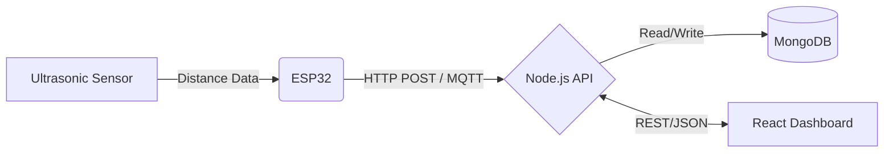

<div align="center">
  
  
  
  
  
  
</div>

<h1 align="center">💧 Smart Water Level Monitoring System</h1>

<p align="center">
  A <strong>full-stack, real-time IoT monitoring system</strong> built to measure the water levels of overhead tanks using an <strong>ESP32 Microcontroller</strong> and an <strong>Ultrasonic Sensor</strong>. It includes a <strong>React UI Dashboard</strong>, an <strong>Express API Backend</strong>, and an <strong>MQTT broker</strong> integration.
</p>

---

## 🌐 Live Demo & Deployment

- **Frontend Dashboard:** [https://water-level-monitor-sandy.vercel.app](https://water-level-monitor-sandy.vercel.app)
- The frontend is deployed automatically using Vercel. 
- Ensure that the backend is hosted on a service like Render or Heroku and properly linked via environment variables.

---

## 🏗 System Architecture

The project is split into three main modules:
1. **IoT Edge Node (`iot/`)**: ESP32 C++ firmware querying an HC-SR04 ultrasonic sensor to calculate real-world tank fill capacity and making HTTP REST API / MQTT updates.
2. **Backend Server (`backend/`)**: Node/Express server parsing the real-time IoT data, executing motor control directives (ON/OFF logic), and saving logs to a **MongoDB Atlas** database.
3. **Frontend Application (`frontend/`)**: Modern React SPA displaying interactive analytics charts (Recharts), dynamic animations (Framer Motion), and live tank fill states.



---

## 🚀 Key Features

* **Real-time Live Monitoring:** Sub-second updates via HTTP / MQTT protocols.
* **Animated Web Dashboard:** Built with React, Tailwind CSS, and Framer Motion.
* **Motor Control Automation:** Allows users to manually overwrite or automatically toggle water pumps on/off depending on the water tank level.
* **Analytics & Historical Logging:** Tracks water usage patterns (`Log.js` schema) and visualizes them natively using Recharts (`Analytics.jsx`).
* **JWT User Authentication:** Complete login/registration gateway with protected routing (`User.js` schema).
* **Environment-Simulated Testing:** Includes a dedicated Node.js `simulator.js` script to mock ESP32 payloads without needing physical hardware.

---

## 🧰 Tech Stack

### 💻 Frontend
- **React 19 (Vite)**
- **Tailwind CSS** & **Framer Motion** (UI & Animations)
- **Recharts** (Data Visualization)
- **Axios** (API Requests)

### ⚙️ Backend
- **Node.js** & **Express** (API Gateway)
- **MongoDB** & **Mongoose** (NoSQL Database)
- **JSON Web Tokens (JWT)** & **Bcrypt.js** (Authentication)
- **MQTT.js** (IoT Message Queuing)

### 📡 IoT Hardware
- **ESP32** NodeMCU
- **HC-SR04** Ultrasonic Distance Sensor

---

## 📁 Project Structure

```
water-level-monitor/
├── backend/            # Express.js REST API server
│   ├── config/         # MongoDB & MQTT config
│   ├── controllers/    # Route controllers (auth, tank, analytics)
│   ├── middleware/     # API security (JWT validation)
│   ├── models/         # Mongoose Schemas (User, Tank, Log)
│   └── routes/         # Express endpoint definitions
├── frontend/           # React Web Interface
│   ├── src/
│   │   ├── components/ # Reusable UI pieces (TankVisualizer, Navbar)
│   │   ├── pages/      # Views (Dashboard, Analytics, Landing)
│   │   └── context/    # React Context API (Auth Context)
├── iot/                # Hardware & Simulation
│   ├── esp32_example.ino # Arduino deployment firmware
│   └── simulator.js    # ESP32 local software mock
└── DEPLOYMENT.md       # Production hosting instructions
```

---

## ⚙️ Quick Start Installation Guide

### 1️⃣ Clone the Repository
```bash
git clone https://github.com/Yuvaraj007A/water-level-monitor.git
cd water-level-monitor
```

### 2️⃣ Start the Backend
```bash
cd backend
npm install
```
Create a `.env` file in the root of the backend folder:
```env
PORT=5000
MONGO_URI=your_mongodb_atlas_connection_string
JWT_SECRET=your_secret_key
MQTT_BROKER_URL=mqtt://broker.emqx.io
```
```bash
npm run dev
```

### 3️⃣ Start the Frontend
Open a new terminal session.
```bash
cd frontend
npm install
```
Start the development server:
```bash
npm run dev
```
Navigate to `http://localhost:5173`.

### 4️⃣ Deploy the IoT Node (Optional)
If you have hardware on hand, flash the `iot/esp32_example.ino` script onto your board applying your local Wi-Fi credentials. Otherwise, simulate hardware using the provided mock script:
```bash
cd iot
node simulator.js
```

---

## 👨‍💻 Author
**A. Yuvaraj**
- Full Stack Developer & IoT Enthusiast
- Ethical Hacking Aficionado

## 📜 License
This project is licensed under the MIT License.
