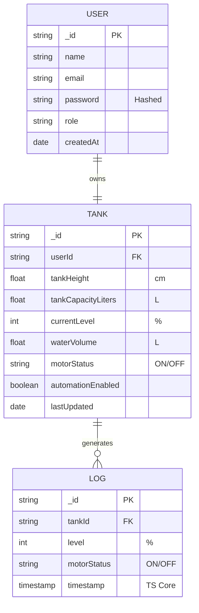
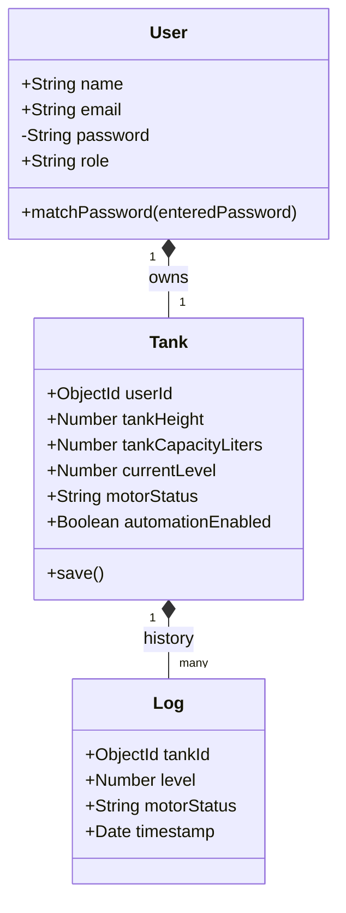
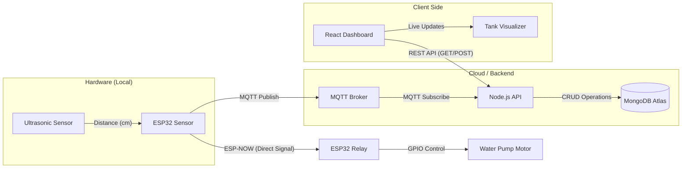
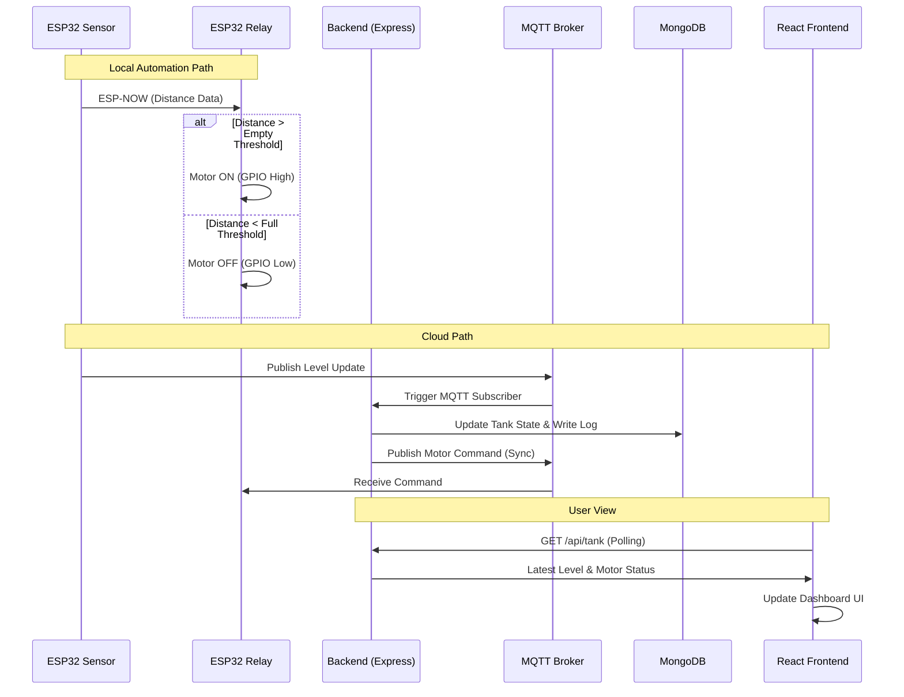
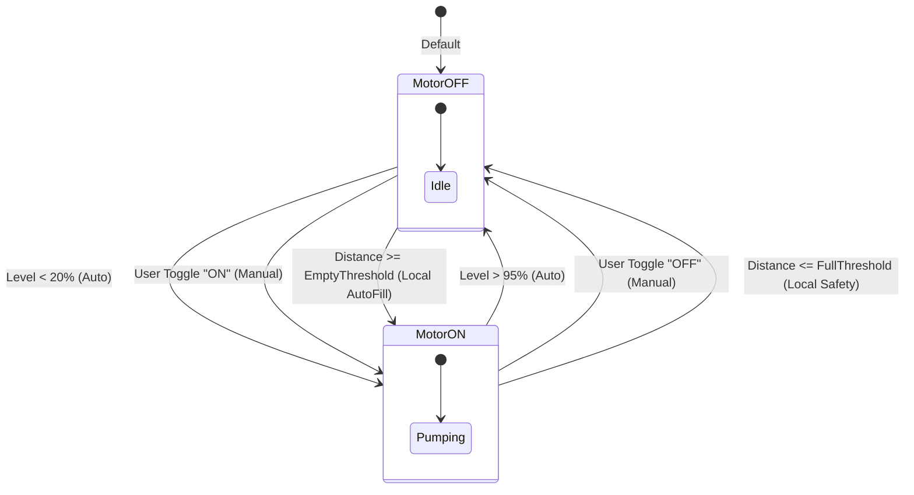
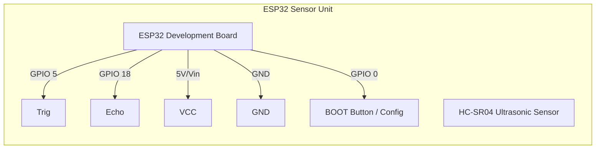
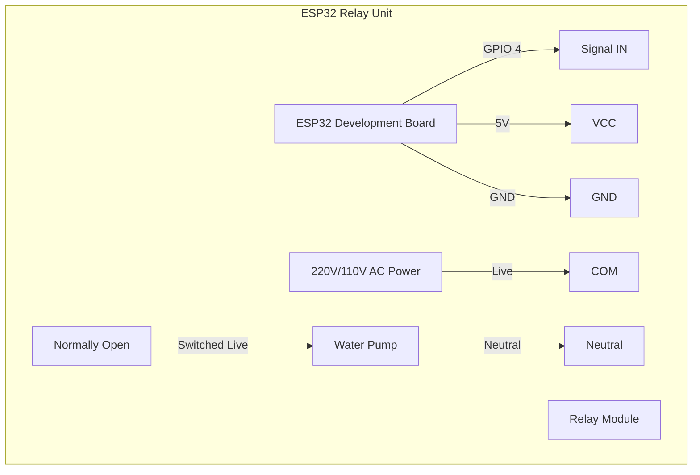

# 📊 System Documentation Diagrams

This document contains the structural and behavioral diagrams for the **Smart Water Level Monitoring System**.

---

## 🏗️ 1. ER Diagram (Entity-Relationship)
This diagram shows the database schema and how entities are connected in MongoDB.

---

## 🧬 2. UML Class Diagram (Backend Architecture)
This shows the structure of the data models and their associated methods.

---

## 🔄 3. Data Flow Diagram (DFD Level-1)
This diagram shows how data moves through the system from the sensor hardware to the user.

---

## ⏱️ 4. Sequence Diagram (Real-time Interaction)
How the components communicate during a typical water level update cycle.

---

## 🔌 5. System State Diagram (Motor Logic)
Describes the states and transitions of the water pump motor.

---

## 🔌 6. Circuit Schematic (Hardware Setup)

The system consists of two separate ESP32 units. Below are the wiring instructions for each.

### 📡 Unit A: Sensor Node (Remote/Tank Location)
This unit is responsible for measuring the water level and transmitting data wirelessly.

| Component | ESP32 Pin | Component Pin | Notes |
| :--- | :--- | :--- | :--- |
| **HC-SR04** | 5 (GPIO 5) | Trig | Trigger Pin |
| **HC-SR04** | 18 (GPIO 18) | Echo | Echo Pin |
| **HC-SR04** | Vin / 5V | VCC | 5V Required |
| **HC-SR04** | GND | GND | Common Ground |
| **Config Button**| 0 (GPIO 0) | Pin 1 | Uses internal Pull-up (BOOT button) |

### ⚡ Unit B: Relay Node (Motor/Pump Location)
This unit receives signals and controls the high-voltage water pump.

| Component | ESP32 Pin | Component Pin | Notes |
| :--- | :--- | :--- | :--- |
| **Relay Module**| 4 (GPIO 4) | IN / Sig | Controls the relay coil |
| **Relay Module**| Vin / 5V | VCC | 5V for Relay Coil |
| **Relay Module**| GND | GND | Common Ground |
| **Config Button**| 0 (GPIO 0) | Pin 1 | Uses internal Pull-up (BOOT button) |

> [!CAUTION]
> **HIGH VOLTAGE WARNING**: The Relay Unit involves switching AC Mains (110V/220V). Ensure all connections are insulated and the project is housed in a non-conductive enclosure. Never touch the relay contacts while connected to power.

